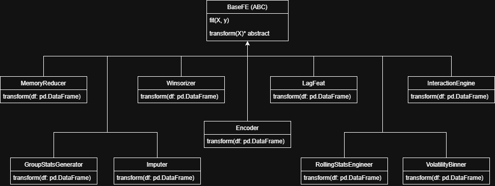

# Financial Time-Series Predictor
AI-driven hybrid LightGBM–Ridge model for dynamic financial time-series allocation with Streamlit UI.


[](https://www.python.org/)
[](LICENSE)
[](https://github.com/Simarbir2112006/financial-time-series-predictor)
[](https://github.com/Simarbir2112006/financial-time-series-predictor/stargazers)
[](https://financial-time-series-predictor.streamlit.app/)

---

## 1 — Overview

This repository implements a production-minded system for financial time-series forecasting and tactical asset allocation. It combines a hybrid modeling approach (gradient-boosted trees + linear regularized regression) with a rolling-window pipeline, volatility-aware allocation, and an interactive Streamlit interface for visualization and lightweight monitoring.

Why hybrid models:
- Tree-based boosters (LightGBM) capture nonlinear relationships, interactions, and regime-dependent patterns.
- Linear Ridge regression provides a stable, low-bias baseline that improves out-of-sample robustness.
- A pragmatic blend increases stability of signals and affords clearer behavior for allocation and risk controls.

Tactical asset allocation:
- Signals are converted into position sizes using volatility scaling and configurable rebalancing rules.
- The allocation logic emphasizes risk-normalized exposures to maintain consistent portfolio volatility.

Real-world uses:
- Tactical allocation prototypes for multi-asset portfolios.
- Signal generation and ranking for quant research or alpha-sourcing.
- Rapid evaluation and monitoring of production-style forecasting pipelines.

---

## 2 — Features

- Core modules (aligned to repository)
  - src/config.py — configuration utilities.
  - src/model.py — model definitions and training/prediction primitives.
  - src/pipeline.py — data processing, feature transforms and walk-forward logic.
  - src/train.py — training CLI entrypoint and orchestrator.
  - src/predict.py — prediction CLI for out-of-sample scoring.
  - src/utils.py — helpers, metrics and IO utilities.

- Model & artifacts
  - Hybrid modeling workflow that combines nonlinear and linear components.
  - Artifacts folder includes prebuilt artifacts: artifacts/hull_model.pkl, artifacts/selected_features.pkl.

- Data & generators
  - Synthetic/demo data generators: generate_bull_market.py, generate_demo_cycle.py.
  - Sample and training datasets in data/: train.csv, test.csv, demo_market_cycle.csv, bull_market_test.csv.

- UI
  - Streamlit application at ui/app.py for interactive analysis and visualizations.

- Pipeline features
  - Rolling-window processing suitable for walk-forward training and inference.
  - Feature engineering and selection integrated into pipeline module.
  - Centralized configuration via src/config.py.

---

## 3 — Project structure

Repository top-level (actual structure):

```
.
├── .gitignore
├── LICENSE
├── artifacts
│   ├── hull_model.pkl
│   └── selected_features.pkl
├── assets
│   └── banner.png
├── data
│   ├── bull_market_test.csv
│   ├── demo_market_cycle.csv
│   ├── test.csv
│   └── train.csv
├── requirements.txt
├── src
│   ├── __pycache__/
│   ├── config.py
│   ├── model.py
│   ├── pipeline.py
│   ├── predict.py
│   ├── train.py
│   └── utils.py
├── synthetic_data_generator
│   ├── generate_bull_market.py
│   └── generate_demo_cycle.py
└── ui
    └── app.py
```

---

## 4 — Architecture diagram

High-level flow:

```
Raw Market Data (data/*.csv)
      |
      v
[ src/pipeline.py ] — ingestion, rolling-window, feature transforms
      |
      v
[ Engineered Features ] -> [ src/model.py ] (hybrid training & predict)
      |
      v
[ Feature Selection (selected_features.pkl) ]
      |
      v
[ Allocation Logic (utils.py) ] -> allocations
      |
      v
[ ui/app.py ] (Streamlit) → Visualization & CSV export
```

ASCII diagram:

```
[ data/*.csv ] -> [pipeline.py]
                       |
                       v
             [Feature Engineering]
                       |
                       v
                [Hybrid Model]
                       |
                       v
    [Feature Selection (selected_features.pkl)]
                       |
                       v
          [Allocation Logic (utils.py)]
                       |
                       v
            [ui/app.py — Streamlit]
```

---

## 5 — Installation & setup

Prerequisites
- Python 3.8+ (3.9/3.10 recommended)
- Git
- Optional: virtualenv or conda

Clone
```bash
git clone https://github.com/Simarbir2112006/financial-time-series-predictor.git
cd financial-time-series-predictor
```

Create and activate venv
```bash
python -m venv .venv
source .venv/bin/activate        # macOS / Linux
.venv\Scripts\activate           # Windows (PowerShell)
```

Install dependencies
```bash
pip install --upgrade pip
pip install -r requirements.txt
```

Notes
- The repository includes artifacts/hull_model.pkl for reference and faster demo runs.
- Adjust configuration parameters inside src/config.py or via environment variables where supported.

---

## 6 — Running the system

Training (orchestrated by src/train.py)
```bash
python -m src.train
```
(If configs are not present, edit src/config.py or create a config module according to your environment.)

Prediction (batch / out-of-sample)
```bash
python -m src.predict
```

Streamlit UI
```bash
streamlit run ui/app.py
```

Quick demo data generation
```bash
cd synthetic_data_generator
python generate_demo_cycle.py
python generate_bull_market.py
```

---

## 7 — Walkthrough


---

## 8 — OOP & design concepts mapping

The repository is implemented with a modular code organization that blends object-oriented patterns and functional pipeline design in the following ways:

- Abstraction
  - High-level pipeline and model responsibilities are exposed through clear module APIs (src/pipeline.py, src/model.py). Config and I/O are abstracted via src/config.py and src/utils.py.

- Inheritance (where applicable)
  - Model components are structured so that multiple model implementations or wrappers can be introduced with minimal changes to the orchestration code.

- Polymorphism
  - Training and prediction orchestration expects model-like objects or interfaces; you can interchange model artifacts and adapt loaders without changing the pipeline drivers.

- Encapsulation
  - Data preparation, feature transforms, and model internals are encapsulated in dedicated modules. Internal helper functions remain local to modules while public functions provide stable interfaces.

- Modularization
  - Modules are segregated by responsibility: config, pipeline, model, train, predict, UI. This enables independent development, testing, and replacement of components.

---

## 9 — UML & Diagrams (placeholders)



---

## 10 — Artifacts & data

Key files and their purpose:
- artifacts/hull_model.pkl — serialized model artifact included for demo/testing.
- artifacts/selected_features.pkl — feature selection snapshot used by model.
- data/train.csv — primary training dataset (large).
- data/test.csv — test set for predictions.
- data/demo_market_cycle.csv, data/bull_market_test.csv — synthetic/demo market cycles for validation.

---

## 11 — Tech stack

- Language: Python 3.8+
- Data: pandas, numpy
- Modeling: scikit-learn, lightgbm
- UI: Streamlit
- Serialization: joblib / pickle
- DevOps: GitHub (repo), recommended GitHub Actions CI

See requirements.txt for declared dependency versions.

---

## 12 — License

This project is published under the MIT License. See LICENSE for the full terms.

---

## 13 — Author

- Name: Simarbir Singh Sandhu (GitHub: Simarbir2112006)
- GitHub: [Simarbir2112006](https://github.com/Simarbir2112006)
- LinkedIn: [Simarbir Singh Sandhu](https://www.linkedin.com/in/simarbir-singh-sandhu/)
- X: [sandhusimarbir](https://x.com/sandhusimarbir)

---