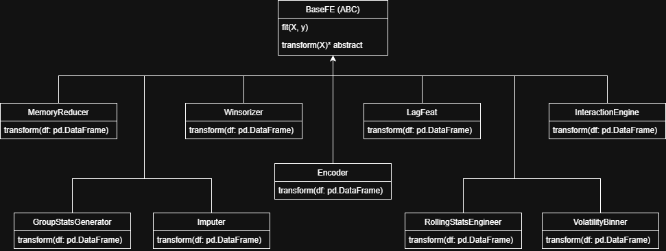

# Financial Time-Series Predictor

Hybrid LightGBM + Ridge model for financial time-series forecasting and tactical asset allocation, with a Streamlit UI.


[](https://financial-time-series-predictor.streamlit.app/)

---

## Overview

LightGBM captures nonlinear regime-dependent patterns; Ridge provides a stable low-bias baseline. Signals feed into a volatility-aware allocation layer that normalises position sizes to consistent portfolio risk. A rolling-window pipeline handles walk-forward training and out-of-sample inference throughout.

---

## Walkthrough

https://github.com/user-attachments/assets/walkthrough.mp4

---

## Project Structure

```
.
├── artifacts/
│   ├── hull_model.pkl          # serialised model for demo runs
│   └── selected_features.pkl
├── assets/
│   └── banner.png
├── data/
│   ├── train.csv
│   ├── test.csv
│   ├── demo_market_cycle.csv
│   └── bull_market_test.csv
├── src/
│   ├── config.py               # centralised configuration
│   ├── model.py                # hybrid model definition
│   ├── pipeline.py             # ingestion, features, walk-forward logic
│   ├── train.py                # training entrypoint
│   ├── predict.py              # batch inference
│   └── utils.py                # metrics and IO helpers
├── synthetic_data_generator/
│   ├── generate_bull_market.py
│   └── generate_demo_cycle.py
├── ui/
│   └── app.py                  # Streamlit dashboard
└── requirements.txt
```

---

## Architecture

```
Raw Market Data (data/*.csv)
        │
        ▼
[ pipeline.py ] — rolling-window ingestion + feature engineering
        │
        ▼
[ model.py ] — hybrid training (Ridge trend + LightGBM residuals)
        │
        ▼
[ utils.py ] — volatility-aware allocation
        │
        ▼
[ ui/app.py ] — Streamlit visualisation + CSV export
```

---

## Quick Start

```bash
git clone https://github.com/Simarbir2112006/financial-time-series-predictor.git
cd financial-time-series-predictor

python -m venv .venv
source .venv/bin/activate        # Windows: .venv\Scripts\activate
pip install -r requirements.txt
```

**Train**
```bash
python -m src.train
```

**Predict**
```bash
python -m src.predict
```

**Streamlit UI**
```bash
streamlit run ui/app.py
```

**Generate synthetic data**
```bash
cd synthetic_data_generator
python generate_demo_cycle.py
python generate_bull_market.py
```

---

## UML



---

## Tech Stack

`Python` · `pandas` · `numpy` · `scikit-learn` · `LightGBM` · `Streamlit`

---

## License

MIT — see [LICENSE](LICENSE).

---

## Author

**Simarbir Singh Sandhu**  
[GitHub](https://github.com/Simarbir2112006) · [LinkedIn](https://www.linkedin.com/in/simarbir-singh-sandhu/) · [X](https://x.com/sandhusimarbir)
